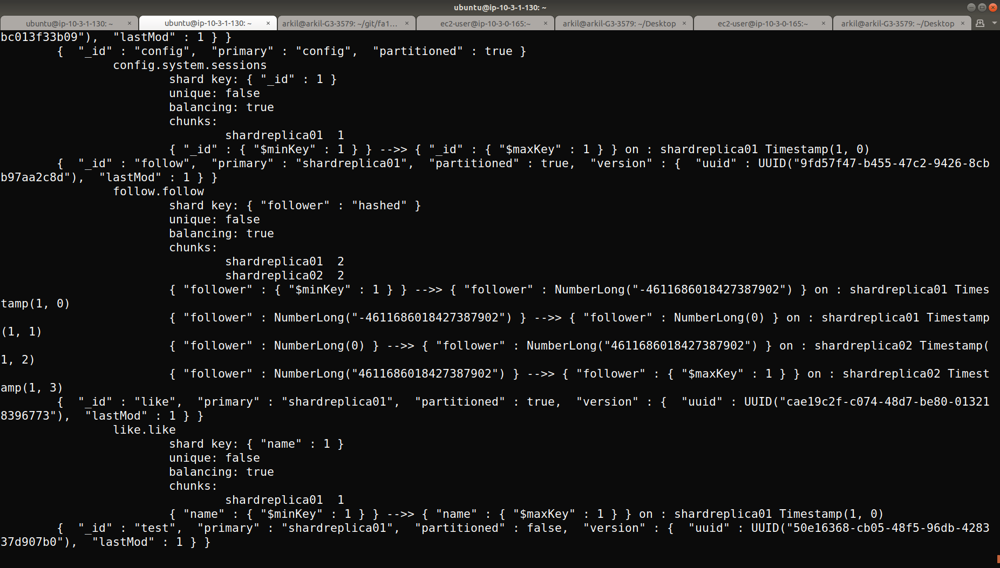
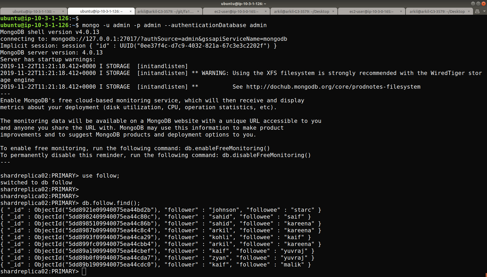
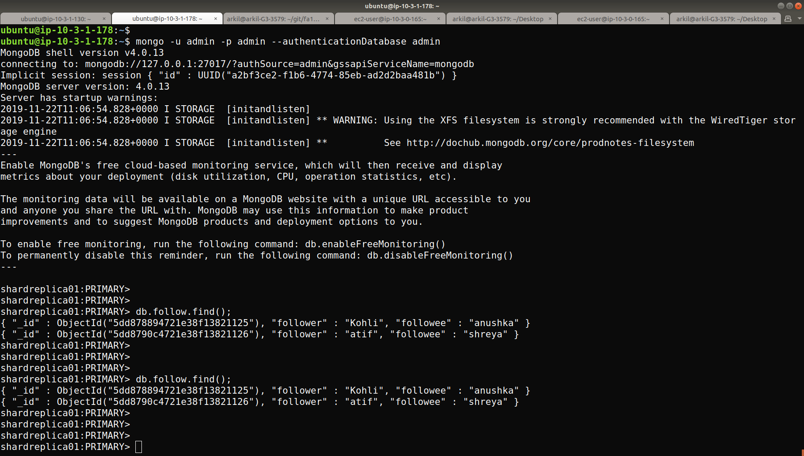

# Instructions on setting up MongoDb Sharding

1) Create 7 Instances with Mongo installed

sudo apt-key adv --keyserver hkp://keyserver.ubuntu.com:80 --recv 9DA31620334BD75D9DCB49F368818C72E52529D4
echo "deb [ arch=amd64,arm64 ] https://repo.mongodb.org/apt/ubuntu xenial/mongodb-org/4.0 multiverse" | sudo t
ee /etc/apt/sources.list.d/mongodb.list
sudo apt update
sudo apt install mongodb-org

openssl rand -base64 741 > keyFile
sudo mkdir -p /opt/mongodb
sudo cp keyFile /opt/mongodb
sudo chown mongodb:mongodb /opt/mongodb/keyFile
sudo chmod 0600 /opt/mongodb/keyFile

Create mongod.service

sudo vi /etc/systemd/system/mongod.service
[Unit]
	Description=High-performance, schema-free document-oriented database
	After=network.target
[Service]
	User=mongodb
	ExecStart=/usr/bin/mongod --quiet --config /etc/mongod.conf
[Install]
	WantedBy=multi-user.target

sudo systemctl enable mongod.service
sudo service mongod restart
sudo service mongod status

2)  Modify /etc/hosts of all the nodes

Add private ip and name

10.3.1.162 configsvr1  
10.3.1.186 configsvr2 
10.3.1.178 shardsvr1
10.3.1.251 shardsvr2
10.3.1.126 shardsvr3
10.3.1.23 shardsvr4
10.3.1.130 mongos

3 ) Setup 2 clusters as Config Server.

Modify /etc/mongod.conf

net:
  port: 27018
  bindIp: 0.0.0.0

replication:
   replSetName: "replconfig01"

sharding:
   clusterRole: configsvr

security:
   keyFile: /opt/mongodb/keyFile

 4) Login in to ConfigServer and initiate replica set
 
 rs.initiate(
  {
    _id: "replconfig01",
    configsvr: true,
    members: [
      { _id : 0, host : "configsvr1:27018" },
      { _id : 1, host : "configsvr2:27018" }
    ]
  }
)  

5) Create 2 Shards having  2 Replica Set

Shard1:(In both Nodes)

Modify  /etc/mongod.conf

net:
  port: 27017
  bindIp: 0.0.0.0

replication:
   replSetName: "shardreplica01"

sharding:
   clusterRole: shardsvr

 Login in to Shard Server and initiate replica set
 
 rs.initiate(
   {
     _id : "shardreplica01",
     members: [
       { _id : 0, host : "shardsvr1:27017" },
       { _id : 1, host : "shardsvr2:27017" }
     ]
   }
 )

Shard2:(In both Node)

Modify  /etc/mongod.conf

net:
  port: 27018
  bindIp: 0.0.0.0

replication:
   replSetName: "shardreplica02"

sharding:
   clusterRole: shardsvr

 Login in to Shard Server and initiate replica set
 
 rs.initiate(
   {
     _id : "shardreplica02",
     members: [
       { _id : 0, host : "shardsvr3:27017" },
       { _id : 1, host : "shardsvr4:27017" }
     ]
   }
 )

6) Create Mongo Query Writer

Modify  /etc/mongod.conf

net:
  port: 27019
  bindIp: 0.0.0.0

 To start cmd line mongo

 mongos --configdb "replconfig01/configsvr1:27018,configsvr2:27018"

In Mongo Shell:

 sh.addShard( "shardreplica01/shardsvr1:27017")
 sh.addShard( "shardreplica01/shardsvr2:27017")

 sh.addShard( "shardreplica02/shardsvr3:27017")
 sh.addShard( "shardreplica02/shardsvr4:27017")

 sh.status()

 use follow;
 sh.enableSharding("follow")
 sh.shardCollection("follow.follow", { "follower" : "hashed" } )

 

 

 

