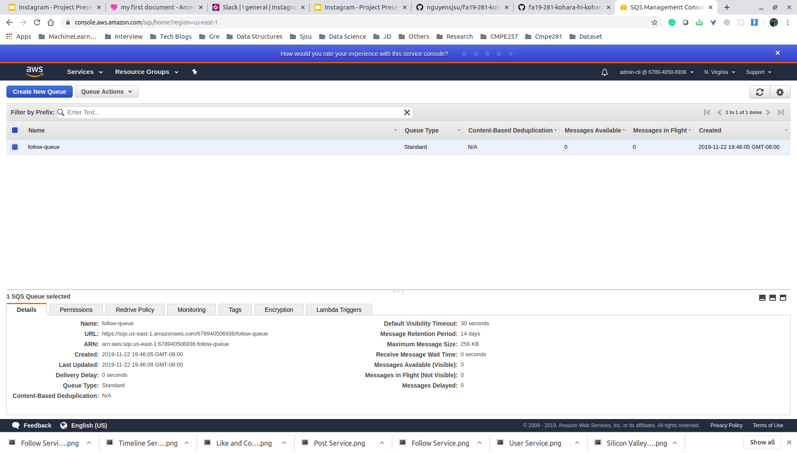
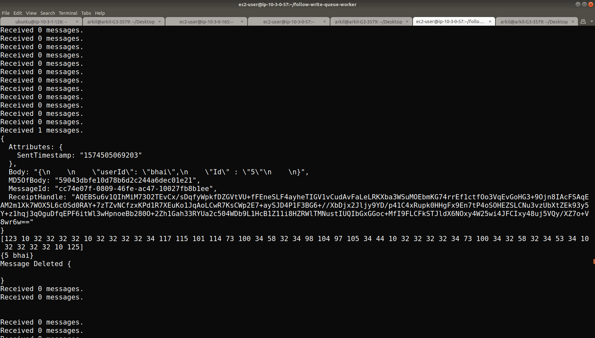
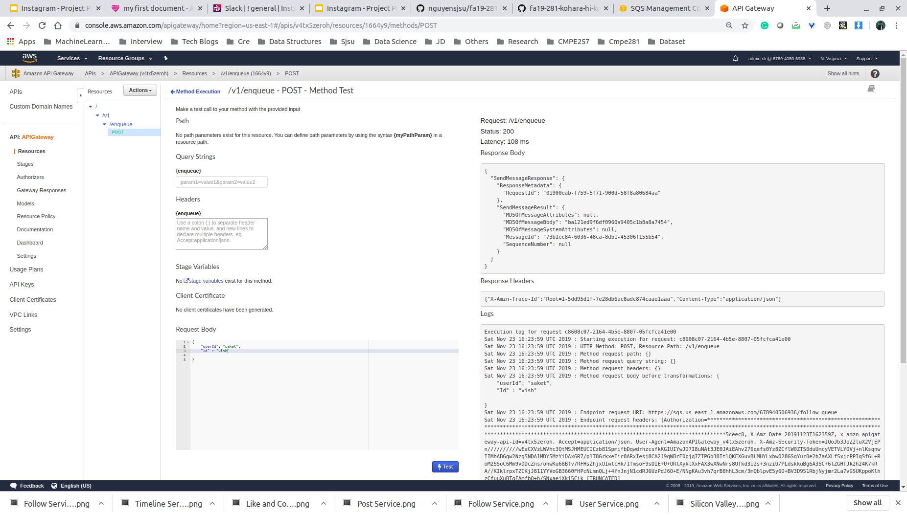

# SQS setup for CQRS

## 1) Created a queue for each write service 
 

## 2) Write worker queue is deployed on Aws instance listening for messages in the queue and executing them
 

## 3)  SQS API gateway is put in to production 
 
