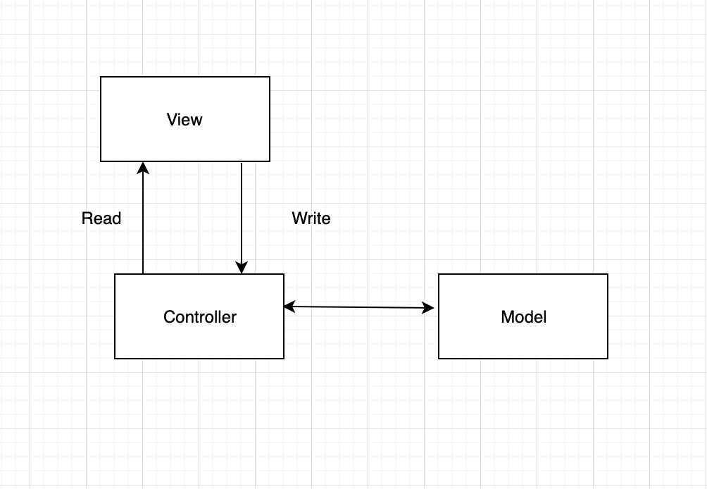
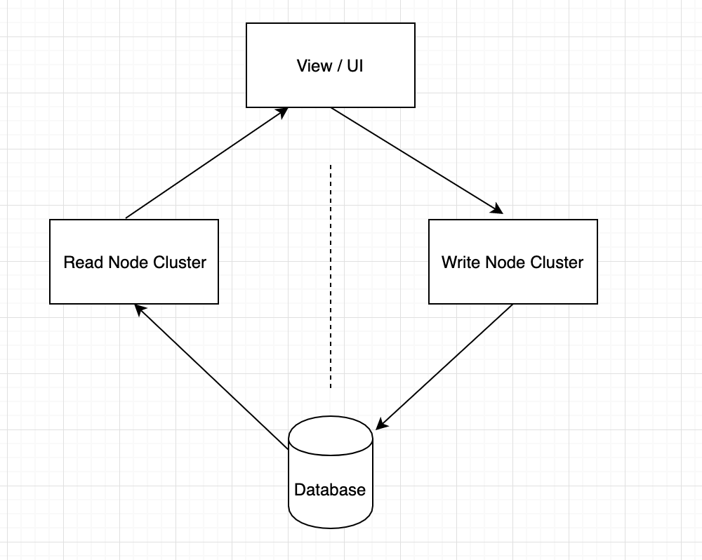
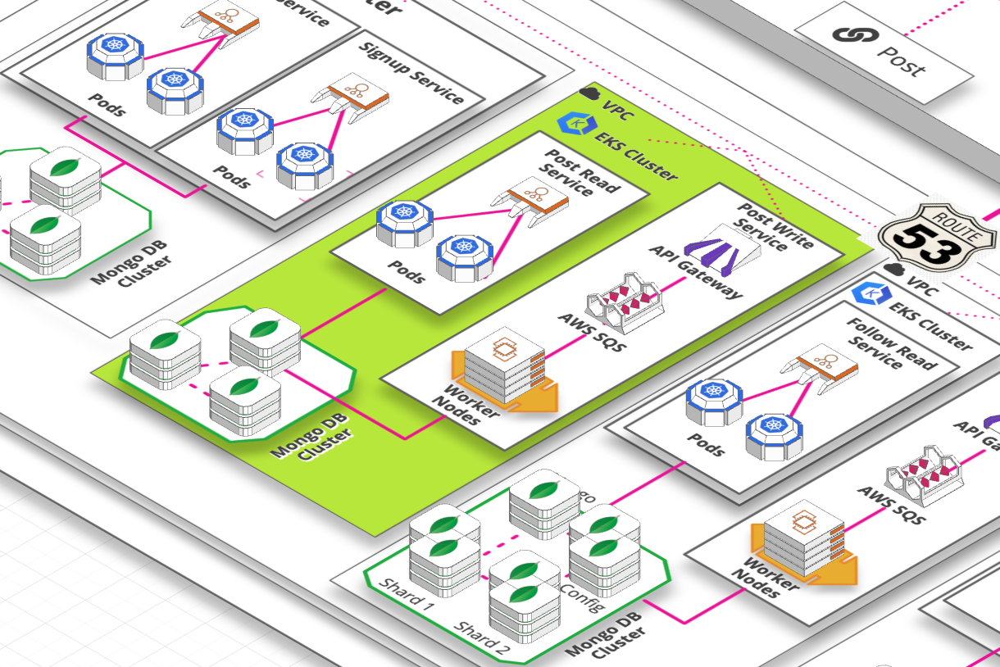

# Architect

## Traditional

In traditional data model, read/write operation happens in the same controller. Often times one it becomes very complex and might also affect the performance of each other. We solved this issue by introducing a separation.

## Read Write Separation

Therefore we tried to introduce a sepration between read and write. 2 different service will point to same database and comminicate with same frontend interface. But both have different intent.

## Read Write Separation and Event sourcing

We analysed the use cases for all the read and write services and found that

- Read service should always return immediatly
- Write service response can be delayed.

Therefore seperated write service by using a message queue.

Deployment

