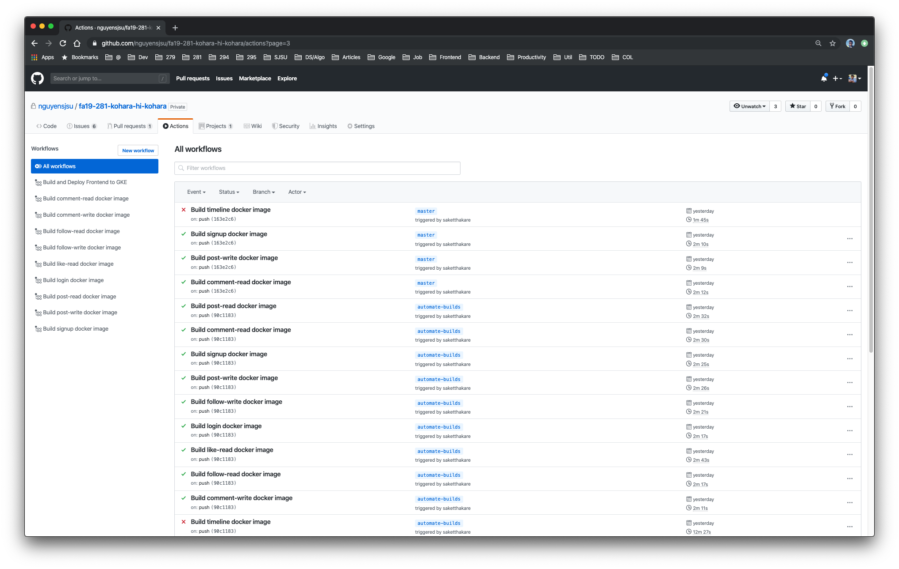
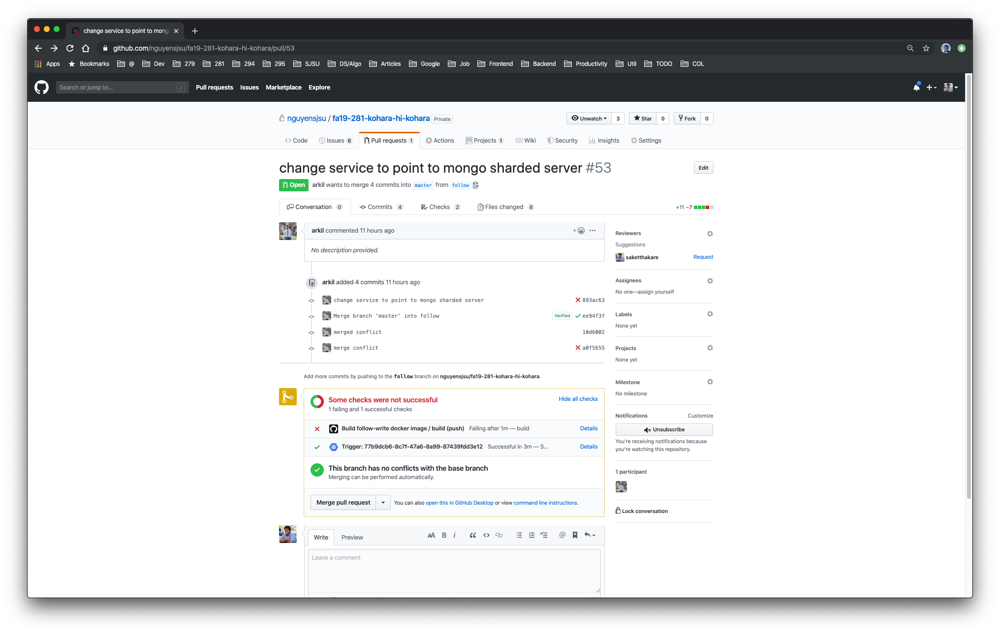
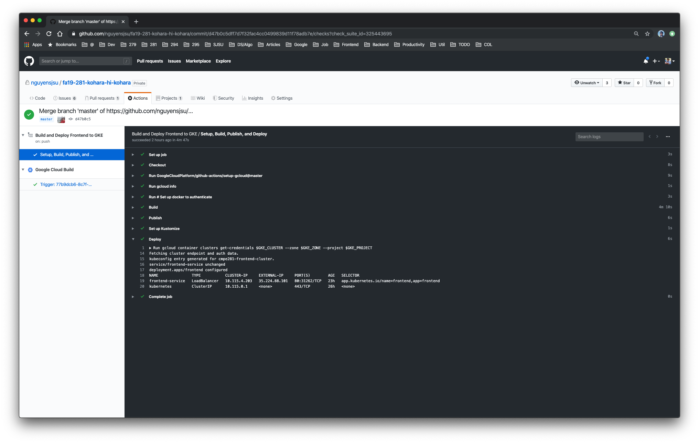
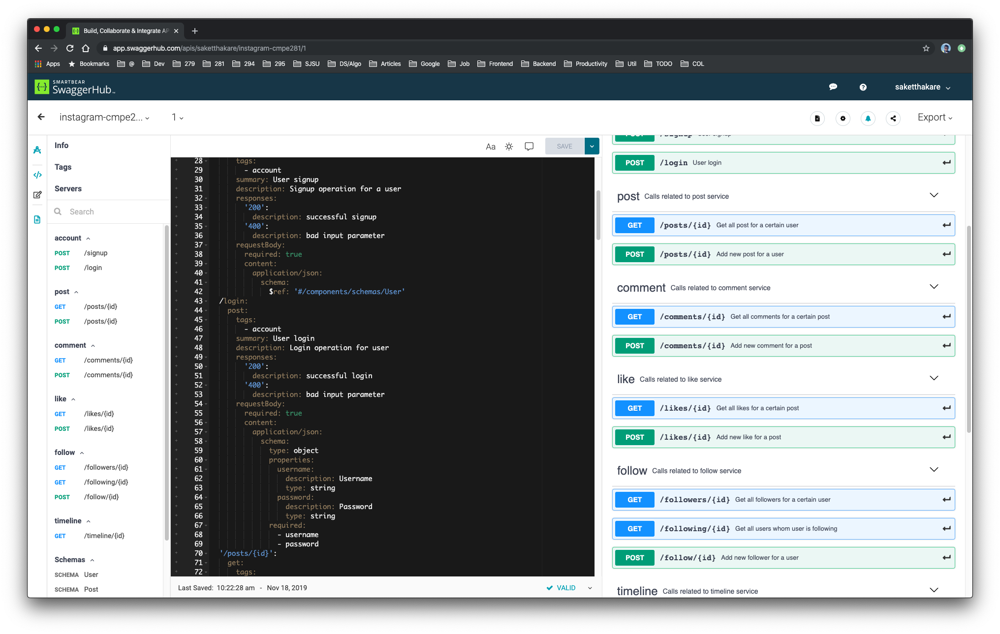
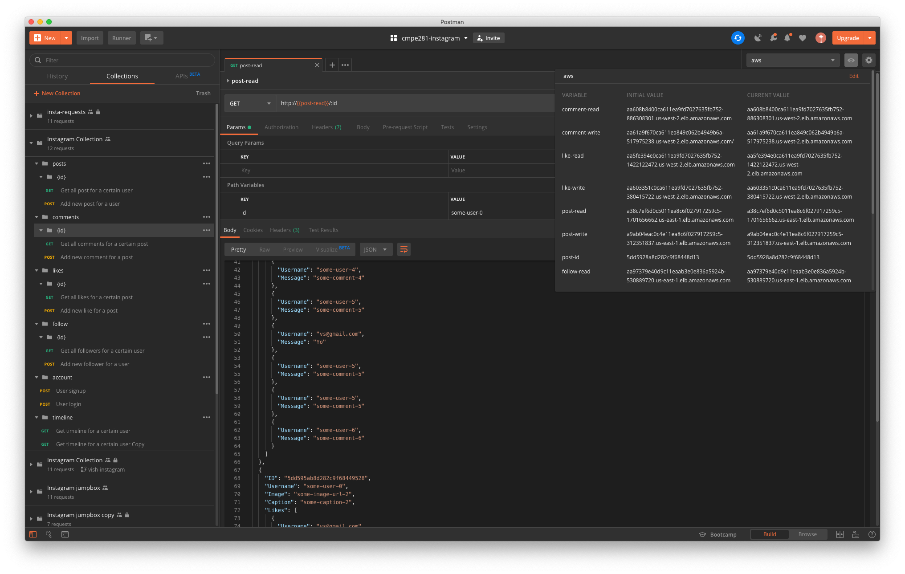
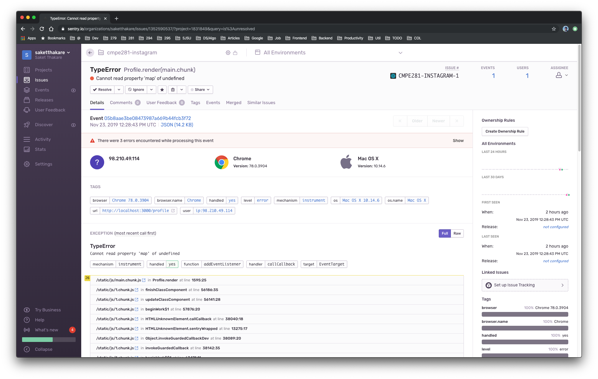

# DevOps

DevOps is the combination of cultural philosophies, practices, and tools that increases an organization’s ability to deliver applications and services at high velocity.

*Source https://aws.amazon.com/devops/what-is-devops/*

Let's discuss how we streamlined our workflow, for faster ` build, test, deploy, plan and monitor`

## Build

Our Instagram application involved `12` different services, which were constantly being updated. After completing a feature some would test it locally, other's would integrate into the system. All the possibilities started with building the image. Therefore we created a pipeline to build our docker images as soon as there was any change made to it. We could then directly use the build image within a few minutes saving time and efforts.

We leveraged `Github Actions` to automate docker image builds. Depending on the files changed in a `push`, relevant build workflows were triggered. When the builds were completed, the newly created images were published to `DockerHub` or `Google Container Registry`.

## Test

Since our diliverables were dockerized we ulized the docker build, publish and deployment procedureas our minimal testing criteria. If for a commit some existing workflow is broken the owner is notified. This also helps us to make changes without breaking each other's code.

Our workflows can be found here. [Workflows](https://github.com/nguyensjsu/fa19-281-kohara-hi-kohara/tree/master/.github/workflows)

## Deploy

Apart from just building the image and publishing it, we found a lot of time was being spent on deploying it. For instance, our Frontend code is deployed on a Kubernetes cluster in the `Google Cloud Platform`. Changes made to frontend were very frequent and were required to deploy. Therefore, we automated our deployment workflow.

For example, when changes are made to our react application and committed on the `master` branch. The code is automatically dockerized with static built files, optimized for production. Later this docker image is published to `Google Container Registry`. Then we initiated a Kubernetes rollout. Kubernetes will implicitly handle the roll out ensuring the availability of our application. Our changes were reflected in a live environment within a few minutes. Our deployment workflow can be seen in the below image.

Our deployment workflows can be found here. [Workflows](https://github.com/nguyensjsu/fa19-281-kohara-hi-kohara/blob/master/.github/workflows/deploy-frontend-gke.yml)

## Plan

API design is hard. Apart from the long brainstorming sessions and appropriate data models, a lot of finer details can be overlooked. Designing an API is a liability since it can lead to endless follow-ups between teammates.

We, therefore, planned that our API design to be a solid blueprint of what our API's want to achieve. We used `OpenAPI` specifications for effective design on Swagger.

While developing the application, we removed the dependency on other teammates by utilizing a mock API server.

[Mock API Server](https://virtserver.swaggerhub.com/saketthakare/instagram-cmpe281/1/timeline/%3Clong%3E "Timeline GET")

During the development phase, we shared a postman repository. Everyone maintained their updated API details and endpoints values in shared collection. Increasing the team's ability to deliver.

## Monitor

The last criteria in the DevOps chain is to monitor our work. With fast iteration and growing size of our application it was very difficult to keep track of our application's quality. Often our team members' encountered issues in the deployed codebase. It became difficult to keep track of these issues. Therefore we integrated `Sentry.io` monitoring in our application. We now get detailed log of errors along many other relevant data points like `Browser`, `Operating System`, system state during the error etc. `Sentry.io` provides a dashboard to track the errors.

Conclusion

We were able to implement 5 aspects of DevOps

- [x] Build
- [x] Test
- [x] Deploy
- [x] Plan
- [x] Monitor
