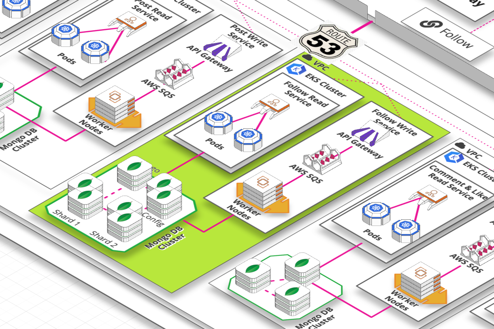
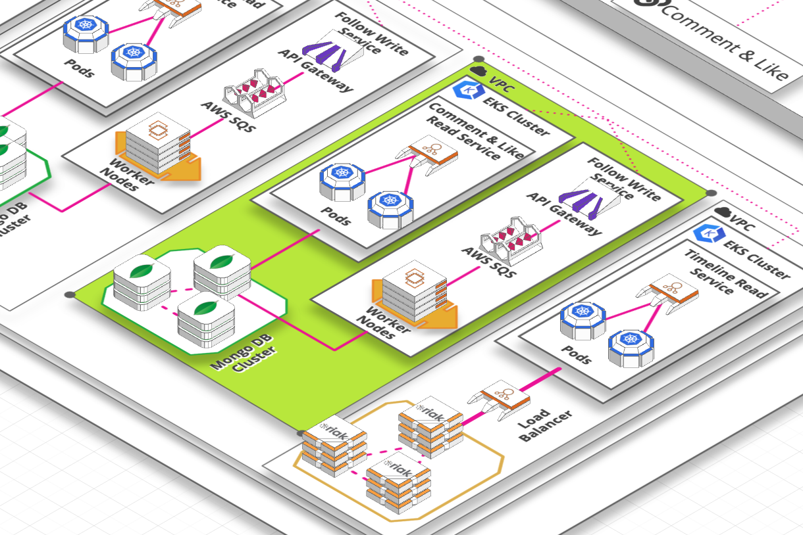
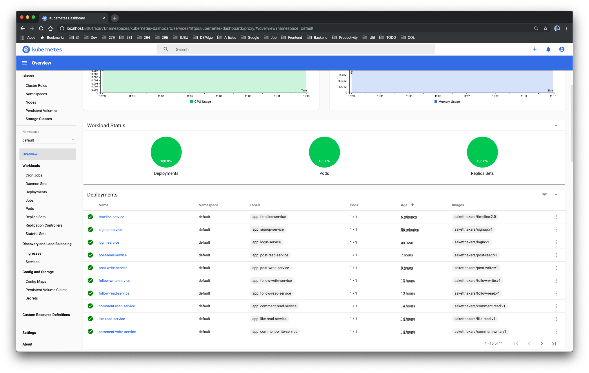
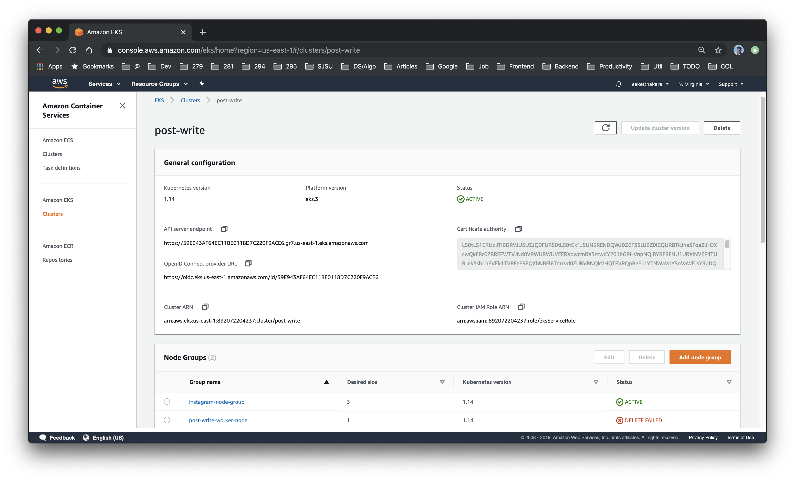
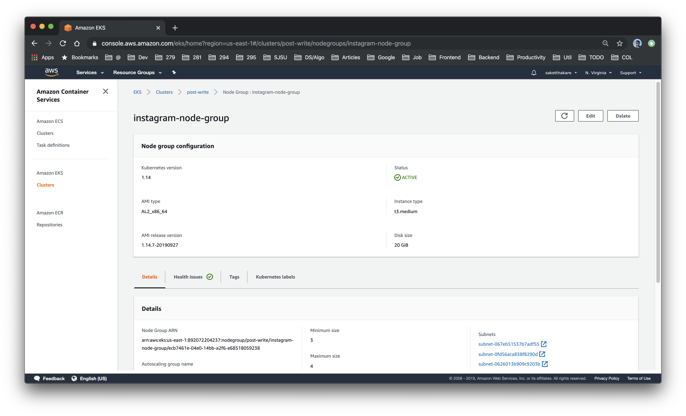
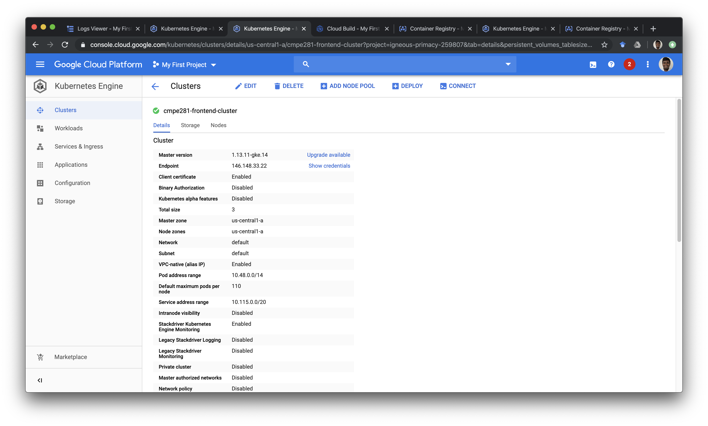
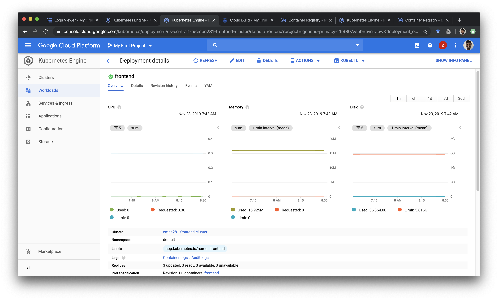

# Kubernetes

## Why?

We have 12 microservices to be deployed for our application. During the development phase, the application keeps changing frequently. We initially deployed every service with a combination of Docker host running a container. This docker host was part of an autoscaling group. All the instances were attached to a load balancer.

Issues with this system were

- The heavy overhead for deploying updates.
- Underutilized resources in Docker host.
- Application Rollouts.
- Too many moving parts to manage.
- Time expensive

We later shifted to deploying these services on Kubernetes. It provided us a combination of Docker host, AutoScaling Groups and Loadbalancers. Along with many other features like easy rollouts, resource utilization, ease of use, etc.

Therefore on every account, we just have 1 Kubernetes cluster to manage all the services affiliated to that user. For example account-related services.

## How?

For deploying the Kubernetes cluster we choose to leverage 2 managed Kubernetes services. `Google Kubernetes Engine` and `Amazon Elastic Kubernetes Service`.

### EKS

[Click here for EKS Setups](https://github.com/nguyensjsu/fa19-281-kohara-hi-kohara/tree/master/eks)

We deployed 5 EKS Clusters.

Account service.

Post Service

Follow Service

Comment/Like Service

Timeline Service

Kubernetes Dashboard

EKS Cluster

EKS Node Group

### GKE

We deployed frontend on GKE

Frontend

Cluster Dashboard

Workload Dashboard
